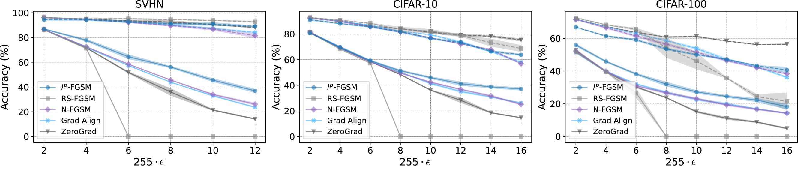
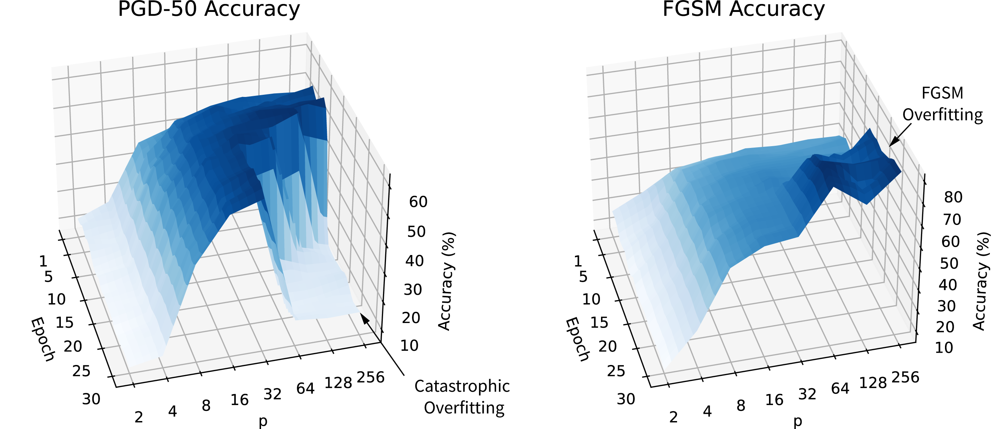
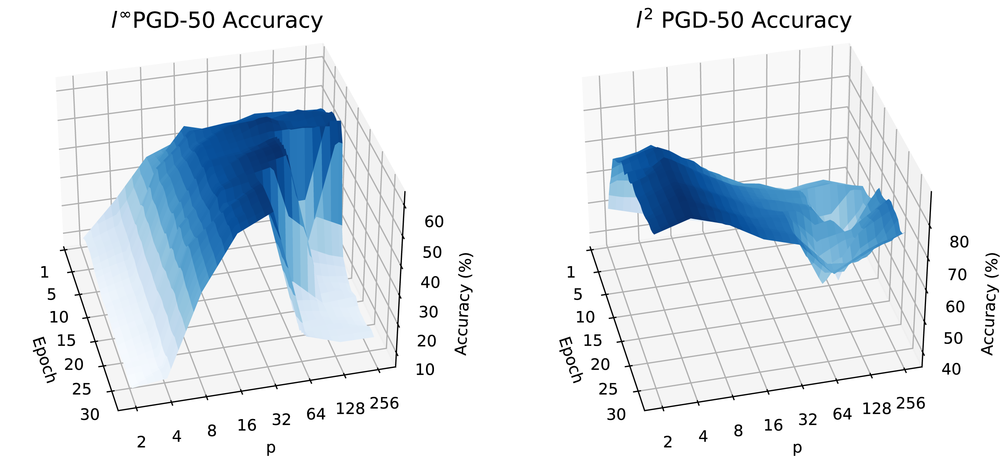

# 🛡️ $l^p$-FGSM: Adaptive Norm Selection for Preventing Catastrophic Overfitting in Fast Adversarial Training

[](https://arxiv.org/abs/2505.02360)
[](https://openreview.net/forum?id=isvrCnlBZb#discussion)
[](https://opensource.org/licenses/MIT)
[](https://www.python.org/downloads/)
[](https://pytorch.org/)
[](https://tensorflow.org/)

**[Paper](https://openreview.net/pdf?id=isvrCnlBZb) | [Poster](https://neurips.cc/virtual/2025/125163) | [Slides](https://neurips.cc/virtual/2025/125163)**

*Accepted at NeurIPS 2025 Workshop on Reliable ML from Unreliable Data*

## 🎯 TL;DR

**$l^p$-FGSM** prevents **Catastrophic Overfitting (CO)** in fast adversarial training through **adaptive norm selection**. By dynamically adjusting the $l^p$ norm based on gradient concentration metrics (Participation Ratio and Entropy Gap), our method achieves competitive robustness, without requiring noise injection, regularization, or gradient clipping.

## 🔬 Core Insight

Catastrophic overfitting emerges when **concentrated gradients meet aggressive norm constraints**. We prevent this by monitoring gradient structure during training through:

- **Participation Ratio (PR₁)**: Measures effective gradient dimensionality
- **Entropy Gap (ΔH)**: Quantifies gradient distribution uniformity

When gradients concentrate (low PR₁), we adaptively reduce $p$ to maintain alignment with natural $l^2$ geometry. When gradients distribute uniformly, we increase $p$ to maximize robustness.

<p align="center">
  
  <br>
  <em>Performance comparison across CIFAR-10, CIFAR-100, and SVHN. Our adaptive approach prevents CO while maintaining competitive robustness across all perturbation magnitudes.</em>
</p>

## ✨ Why lp-FGSM?

- **🎯 Prevents CO**: Eliminates catastrophic overfitting
- **⚡ Efficient**: Single-step method: no double backpropagation, no extra regularization
- **🔬 Principled**: Theoretically grounded in fixed-point analysis and gradient geometry  
- **📊 Adaptive**: Automatically adjusts to gradient structure—no manual tuning needed
- **📈 Competitive**: Matches or exceeds state-of-the-art fast adversarial training methods
- **🎛️ Simple**: Minimal hyperparameters, no auxiliary regularization required

## 🚀 Quick Start

### Option 1: Google Colab (Recommended for quick start)

**[📓 Interactive Demo Notebook](lp_FGSM_demo_tf.ipynb)** - Open this notebook and click the Colab badge at the top to run it in Google Colab.

### Option 2: Local Setup
```bash
# Clone the repository
git clone https://github.com/FaresBMehouachi/lpfgsm.git
cd lpfgsm

# Install dependencies
pip install -r requirements.txt

# Launch the notebook
jupyter notebook lpFGSM_demo_tf.ipynb
```

### Basic Usage

```python
# Adaptive lp-FGSM with automatic norm selection
attack = AdaptiveLpFGSM(
    model=your_model,
    epsilon=8/255,
    beta=0.01,  # Angle constraint parameter
    adaptive=True  # Enable adaptive norm selection
)

# Generate adversarial examples (p is selected automatically)
adv_images = attack(images, labels)
```

## 📊 Understanding Catastrophic Overfitting

<p align="center">
  
  <br>
  <em><b>Figure 1</b>: CO as a function of norm p and training epoch on CIFAR-10. Higher p values (closer to l∞) initially show better robustness but suddenly collapse to 0% accuracy (CO). Lower p values prevent CO but sacrifice robustness. Our adaptive method navigates this trade-off automatically.</em>
</p>

**Key Observation**: CO is not just a training instability—it's a fundamental consequence of gradient geometry. When gradients concentrate in few dimensions and meet aggressive $l^\infty$ constraints, the model becomes vulnerable to multi-step attacks while appearing robust to single-step attacks.

## 🧮 The Adaptive Algorithm

### 1. Gradient Concentration Metrics

**Participation Ratio (PR₁)**:

$$\text{PR}_1 = \left(\frac{\|\nabla_x \ell\|_1}{\|\nabla_x \ell\|_2}\right)^2$$

Measures how many dimensions meaningfully contribute to the gradient. Low PR₁ indicates concentration.

**Entropy Gap (ΔH)**:

$$\Delta H = H_m - H$$

where:
- $H = -\sum_i \rho_i \log(\rho_i)$ (Shannon entropy)
- $H_m = -\log\left(\prod_i \rho_i^{1/d}\right)$ (Logarithmic mean entropy)
- $\rho_i = \frac{|\nabla_x \ell_i|}{\|\nabla_x \ell\|_1}$ (normalized gradient components)

Quantifies how uniformly gradient magnitude is distributed across dimensions.

### 2. Adaptive Norm Selection

Based on PR₁ and ΔH, we compute the optimal dual norm $q$:

$$q^* \geq 1 + \frac{\tau\sqrt{d/\text{PR}_1} - 1}{\Delta H}$$

where $\tau = (1 + \beta)\sqrt{\text{PR}_1/d}$ is the angle constraint threshold.

### 3. Attack Generation (Fixed-Point Formulation)

$$\delta^* = \varepsilon \cdot \text{sign}(\nabla_x \ell) \cdot \left|\frac{\nabla_x \ell}{\|\nabla_x \ell\|_q}\right|^{q-1}$$

This formulation naturally interpolates between $l^2$ ($q=2$) and $l^\infty$ ($q=1$) based on gradient structure.

<p align="center">
  
  <br>
  <em><b>Figure 2</b>: Cross-norm robustness transferability. Left plot shows l²-PGD-50 accuracy; right shows l∞-PGD-50 accuracy. Lower p values defend well against l² but fail against l∞. Higher p values defend against both but risk CO. Our adaptive method (marked region p=16-32) achieves balanced robustness.</em>
</p>

## 📈 Key Results

### Benchmark Performance (PGD-50 Attack)

| Dataset | ε | FGSM | RS-FGSM | N-FGSM | GradAlign | ZeroGrad | **lp-FGSM** |
|---------|---|------|---------|---------|-----------|----------|-------------|
| **CIFAR-10** | 8/255 | 0.00% | 0.00% | 49.51% | 50.12% | 48.32% | **51.33%** |
| **CIFAR-10** | 16/255 | 0.00% | 0.00% | 25.11% | 26.24% | 14.66% | **37.14%** |
| **CIFAR-100** | 8/255 | 0.00% | 0.00% | 26.71% | 26.97% | 23.72% | **32.03%** |
| **SVHN** | 8/255 | 0.00% | 0.00% | 45.64% | 43.88% | 35.96% | **56.12%** |

*FGSM and RS-FGSM suffer complete CO (0% accuracy). Our method prevents CO while maintaining competitive robustness.*

### AutoAttack Evaluation (CIFAR-10, WRN-28-8)

| ε | FGSM | RS-FGSM | N-FGSM | **lp-FGSM** |
|---|------|---------|---------|-------------|
| 2/255 | 74.72% | 71.47% | 73.14% | **75.21%** |
| 4/255 | 61.58% | 54.85% | 59.81% | **61.64%** |
| 8/255 | 0.00% | 35.77% | 41.65% | **41.81%** |
| 12/255 | 0.00% | 0.00% | 30.17% | **31.03%** |
| 16/255 | 0.00% | 0.00% | 22.50% | **25.02%** |

*Consistent pattern between PGD-50 and AutoAttack validates our approach across diverse attack strategies.*

### Detailed Results

<details>
<summary><b>CIFAR-10 Performance (Click to expand)</b></summary>

| ε | lp-FGSM | RS-FGSM | N-FGSM | GradAlign | ZeroGrad |
|---|---------|---------|---------|-----------|----------|
| 2/255 | 91.08±0.6<br>80.80±0.2 | **92.86±0.14**<br>**80.91±0.14** | 92.49±0.14<br>81.42±0.34 | 92.54±0.13<br>81.32±0.43 | 92.62±0.16<br>81.41±0.32 |
| 4/255 | 88.15±0.37<br>**69.53±0.8** | **90.74±0.23**<br>68.24±0.19 | 89.64±0.23<br>69.10±0.27 | 89.93±0.34<br>69.80±0.48 | 90.21±0.22<br>69.21±0.21 |
| 6/255 | 85.58±0.52<br>**59.18±0.52** | **88.25±0.22**<br>57.24±0.19 | 85.74±0.32<br>58.26±0.18 | 86.94±0.16<br>59.14±0.16 | 86.11±0.45<br>58.44±0.19 |
| 8/255 | 81.73±0.62<br>**51.33±0.63** | 83.61±1.77<br>0.0±0.0 | 81.64±0.35<br>49.51±0.27 | 82.16±0.21<br>50.12±0.17 | **84.16±0.21**<br>48.32±0.21 |
| 10/255 | 76.56±0.65<br>**45.96±0.71** | **82.17±1.48**<br>0.0±0.0 | 76.94±0.12<br>42.39±0.39 | 79.42±0.28<br>41.42±0.52 | 81.29±0.73<br>36.18±0.19 |
| 12/255 | 73.34±0.6<br>**41.18±1.46** | 78.64±0.74<br>0.0±0.0 | 72.18±0.17<br>36.82±0.27 | 73.72±0.82<br>35.16±0.77 | **79.33±0.92**<br>28.26±1.81 |
| 14/255 | 66.47±0.68<br>**38.72±0.84** | 73.27±2.84<br>0.0±0.0 | 67.86±0.46<br>31.68±0.68 | 66.41±0.52<br>30.85±0.34 | **78.18±0.66**<br>18.56±0.35 |
| 16/255 | 63.8±0.72<br>**37.14±1.04** | 68.68±2.43<br>0.0±0.0 | 56.75±0.44<br>25.11±0.43 | 57.88±0.74<br>26.24±0.43 | **75.43±0.89**<br>14.66±0.22 |

*Top row: Clean accuracy | Bottom row: Robust accuracy (PGD-50)*

</details>

<details>
<summary><b>CIFAR-100 Performance (Click to expand)</b></summary>

| ε | lp-FGSM | RS-FGSM | N-FGSM | GradAlign | ZeroGrad |
|---|---------|---------|---------|-----------|----------|
| 2/255 | 66.83±0.12<br>**55.96±0.68** | **72.62±0.24**<br>51.62±0.56 | 71.52±0.14<br>52.24±0.35 | 71.61±0.23<br>51.51±0.48 | 71.64±0.22<br>52.63±0.64 |
| 4/255 | 61.36±0.37<br>**45.83±0.48** | **68.27±0.21**<br>39.56±0.14 | 66.51±0.48<br>39.96±0.31 | 67.09±0.19<br>39.81±0.48 | 67.21±0.18<br>39.61±0.32 |
| 6/255 | 59.08±0.52<br>**38.21±0.50** | **65.62±0.66**<br>26.61±2.79 | 61.42±0.63<br>30.99±0.27 | 62.86±0.1<br>32.11±0.24 | 63.65±0.12<br>30.28±0.51 |
| 8/255 | 53.54±0.64<br>**32.03±1.26** | 54.28±5.92<br>0.0±0.0 | 56.42±0.65<br>26.71±0.68 | 58.55±0.41<br>26.97±0.61 | **60.78±0.24**<br>23.72±0.16 |
| 10/255 | 50.06±0.48<br>**27.28±0.87** | 46.18±4.88<br>0.0±0.0 | 51.51±0.61<br>23.11±0.49 | 53.85±0.73<br>22.64±0.61 | **61.11±0.39**<br>15.15±0.45 |
| 12/255 | 47.17±0.24<br>**24.51±0.63** | 35.86±0.27<br>0.0±0.0 | 46.42±0.56<br>19.32±0.51 | 46.94±0.86<br>19.94±0.65 | **58.36±0.15**<br>11.12±0.66 |
| 14/255 | 43.26±0.28<br>**22.27±1.02** | 24.42±1.38<br>0.0±0.0 | 42.14±0.36<br>16.62±0.44 | 42.63±0.5<br>16.96±0.14 | **56.24±0.16**<br>8.81±0.34 |
| 16/255 | 40.62±1.7<br>**18.23±1.53** | 21.47±5.21<br>0.0±0.0 | 38.37±0.48<br>14.29±0.38 | 36.17±0.45<br>14.23±0.26 | **56.42±0.29**<br>4.92±0.38 |

</details>

<details>
<summary><b>SVHN Performance (Click to expand)</b></summary>

| ε | lp-FGSM | RS-FGSM | N-FGSM | GradAlign | ZeroGrad |
|---|---------|---------|---------|-----------|----------|
| 2/255 | 94.4±0.44<br>**86.85±0.26** | **96.16±0.13**<br>86.17±0.17 | 96.04±0.24<br>86.46±0.12 | 96.01±0.25<br>86.44±0.15 | 96.08±0.22<br>86.47±0.17 |
| 4/255 | 94.36±0.68<br>**77.77±0.82** | **95.07±0.08**<br>71.25±0.43 | 94.56±0.18<br>72.54±0.21 | 94.57±0.24<br>72.18±0.22 | 94.83±0.19<br>71.64±0.24 |
| 6/255 | 92.77±0.69<br>**64.42±1.7** | **95.16±0.48**<br>0.0±0.0 | 92.27±0.36<br>58.44±0.18 | 92.55±0.26<br>57.36±0.27 | 93.52±0.24<br>51.77±0.58 |
| 8/255 | 91.14±0.69<br>**56.12±0.72** | **94.48±0.18**<br>0.0±0.0 | 89.59±0.48<br>45.64±0.21 | 90.16±0.36<br>43.88±0.16 | 92.43±1.33<br>35.96±2.78 |
| 10/255 | 90.95±1.2<br>**45.58±1.24** | **93.82±0.28**<br>0.0±0.0 | 86.78±0.88<br>33.98±0.48 | 87.26±0.73<br>32.88±0.36 | 90.36±0.33<br>21.36±0.37 |
| 12/255 | 89.06±0.36<br>**36.88±1.40** | **92.72±0.56**<br>0.0±0.0 | 81.49±1.66<br>26.17±0.88 | 84.12±0.44<br>23.64±0.42 | 88.11±0.47<br>14.16±0.38 |

</details>

## 🎓 Theoretical Framework

### Fixed-Point Analysis

Unlike FGSM which relies on local linearity, we adopt a **local convexity framework** that emerges naturally during training. This enables us to reformulate adversarial attack generation as a fixed-point problem:

**Proposition 1** ($l^2$ case): The optimal perturbation $\delta^*$ solves:

$$\delta^* = F(\delta^*) \quad \text{where} \quad F(\delta) = \varepsilon \cdot \frac{\nabla_x \ell(x_0 + \delta)}{\|\nabla_x \ell(x_0 + \delta)\|_2}$$

**Proposition 2** ($l^p$ case): Generalizes to any $p \geq 2$:

$$\delta^* = F_p(\delta^*) \quad \text{where} \quad F_p(\delta) = \varepsilon \cdot \text{sign}(\nabla_x \ell) \cdot \left|\frac{\nabla_x \ell}{\|\nabla_x \ell\|_q}\right|^{q-1}$$

with $\frac{1}{p} + \frac{1}{q} = 1$ (dual norms).

This formulation provides **convergence guarantees** under Lipschitz conditions.

### Gradient Concentration Hypothesis

**Key Insight**: CO occurs when:
1. Gradients concentrate in few dimensions (low PR₁)
2. Aggressive norm constraints (high $p$) amplify this concentration
3. Angular separation between $l^2$ and $l^\infty$ attacks increases

**Lemma 1** (Noise-Induced Alignment): Adding noise increases PR₁, improving alignment between $l^\infty$ and $l^2$ attacks—explaining why noise injection helps but is not necessary with adaptive selection.

**Lemma 2** (Monotonicity): For any gradient and $p \geq 2$:

$$\cos(\theta_{2,\infty}) \leq \cos(\theta_{2,p})$$

Reducing $p$ systematically improves alignment, preventing CO.

### Why This Works

Traditional methods (FGSM, RS-FGSM) use fixed $l^\infty$ constraints that inevitably encounter concentrated gradients during training. Our adaptive approach:

1. **Monitors** gradient concentration via PR₁ and ΔH
2. **Predicts** when CO is likely (sharp drops in metrics)
3. **Adjusts** $p$ to maintain safe gradient geometry
4. **Prevents** the concentrated gradient + aggressive constraint combination

## 💡 Key Insights

### Cross-Norm Robustness Transfer

Our analysis reveals surprising patterns in robustness transferability:

- **$l^2$ training** → Strong $l^2$ defense only
- **$l^\infty$ training** → Defends against both $l^2$ and $l^\infty$ (but risks CO)

### Dataset-Specific Behavior

| Dataset | Complexity | Optimal β | Why |
|---------|-----------|-----------|-----|
| SVHN | Low | 0.01 | Simple patterns tolerate aggressive norms |
| CIFAR-10 | Medium | 0.01 | Balanced complexity |
| CIFAR-100 | High | 0.1 | Complex features require conservative selection |

### Gradient Metrics as Early Warning

Sharp drops in PR₁ and entropy gap **precisely predict** CO onset epochs before accuracy collapse, enabling proactive intervention.

## 📝 Usage

### Training with Adaptive lp-FGSM

```bash
python train_model.py \
  --dataset_name CIFAR10 \
  --epochs 30 \
  --eps 8.0 \
  --adaptive True \
  --beta 0.01 \
  --weight_decay 5e-4
```

### Fixed p Training (for comparison)

```bash
python train_model.py \
  --dataset_name CIFAR10 \
  --epochs 30 \
  --eps 8.0 \
  --p 16.0 \
  --adaptive False
```

### Evaluation

```bash
python pgd_attack.py \
  --model_path checkpoints/cifar10_best.pth \
  --attack_type PGD-50 \
  --eps 8.0
```

## 📚 Citation

If you use this code or find our work helpful, please cite:

```bibtex
@inproceedings{mehouachi2025lpfgsm,
  title={Adaptive Norm Selection Prevents Catastrophic Overfitting 
         in Fast Adversarial Training},
  author={Mehouachi, Fares B. and Jabari, Saif Eddin},
  booktitle={NeurIPS 2025 Workshop on Reliable ML from Unreliable Data},
  year={2025}
}
```

## 🤝 Authors

- **Fares B. Mehouachi** - New York University Abu Dhabi  
  [fm2620@nyu.edu](mailto:fm2620@nyu.edu)
  
- **Saif Eddin Jabari** - New York University Tandon School of Engineering  
  [sej7@nyu.edu](mailto:sej7@nyu.edu)

## 🙏 Acknowledgments

This work was supported by the NYUAD Center for Interacting Urban Networks (CITIES), funded by Tamkeen under the NYUAD Research Institute Award CG001.

## 🔗 Related Work

This project builds upon insights from:

- [Understanding and Improving Fast Adversarial Training](https://github.com/tml-epfl/understanding-fast-adv-training) - GradAlign
- [ZeroGrad: Mitigating and Explaining Catastrophic Overfitting](https://github.com/rohban-lab/catastrophic_overfitting)
- [Make Some Noise: N-FGSM](https://github.com/pdejorge/N-FGSM)
- [Adversarial Training for Free!](https://github.com/mahyarnajibi/FreeAdversarialTraining)

## 📄 License

This project is licensed under the MIT License - see the [LICENSE](LICENSE) file for details.

## 🐛 Contributing

We welcome contributions! Please submit pull requests or open issues for:
- Bug fixes
- Performance improvements
- New features
- Documentation enhancements

## 🌟 Star History

If you find this useful, please ⭐ star the repository!
